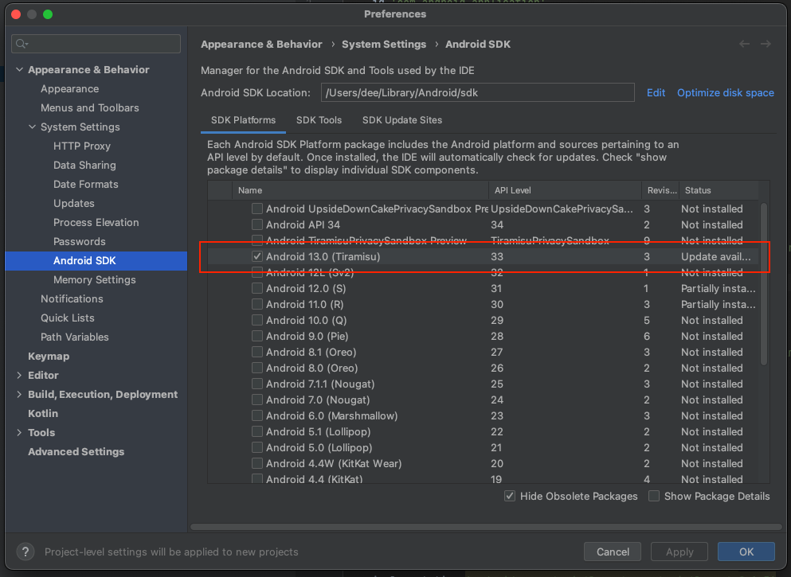
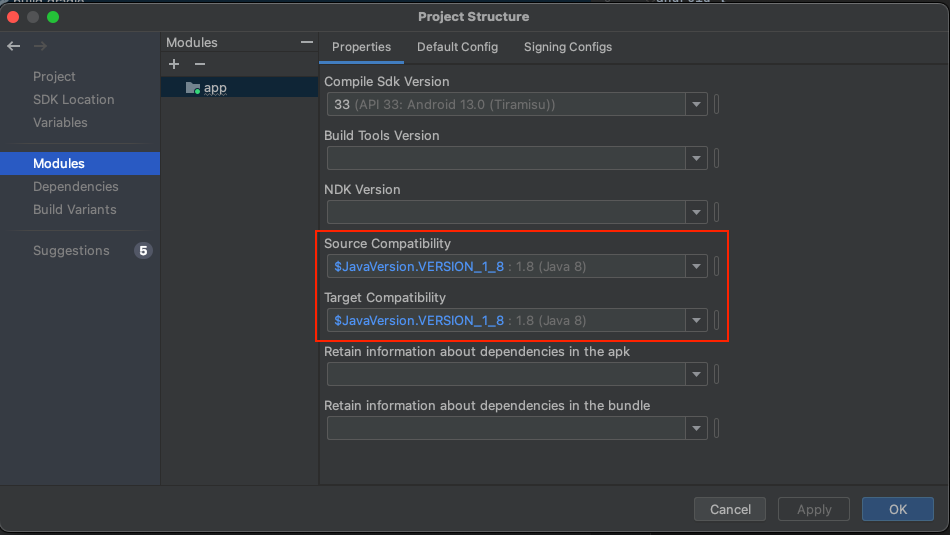

# Skylink App Setup

## Prerequisites
- Git
- Android Studio (latest version recommended)
- An Android device or emulator to run the app

### Cloning the repository
To clone the repository and check out the project, run:

```bash
git clone https://code.cs.umanitoba.ca/comp3350-winter2024/shadedragon-a02-6.git
cd shadedragon-a02-6
```

### Opening the project in Android Studio
Open Android Studio.
On the welcome screen, choose "Open an Existing Project."
Navigate to the cloned repository and select the **app** folder.
Click "OK" to open the project.

## Configuring the Project
Before you build the project, ensure you have the correct Android SDK and build tools installed:

1. Open Android Studio.
2. Navigate to "Tools" > "SDK Manager".

3. In the "Android SDK" tab, check that the Android SDK Platform for API Level 33 is installed. If it is not, install it.
5. Click "OK" to install any missing SDKs or tools.

Additionally, ensure that Java 1.8 is set as the source and target compatibility in your project:

- Navigate to "File" > "Project Structure" > "Project" in Android Studio.

- Under "Project SDK", you should see the JDK version set to 1.8 or similar (this should match the `sourceCompatibility` and `targetCompatibility` specified in your `build.gradle`).


## Building and Running the App
To build and run the app, follow these steps:

1. In Android Studio, select 'Run' > 'Run 'app'' from the menu, or click the green play button on the toolbar.
2. Choose the device you want to run the app on from the target device dropdown.
3. Android Studio will build the project and install the app on the selected device/emulator.
